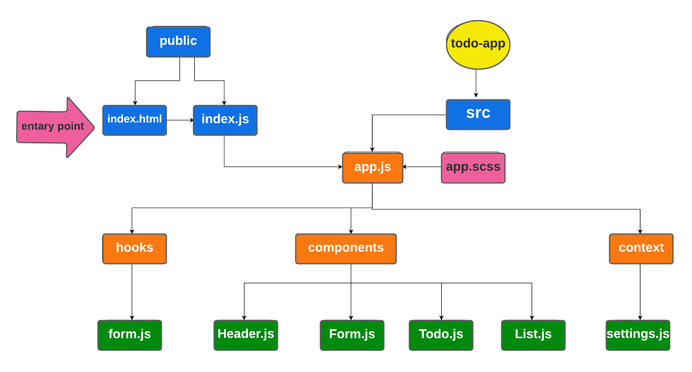
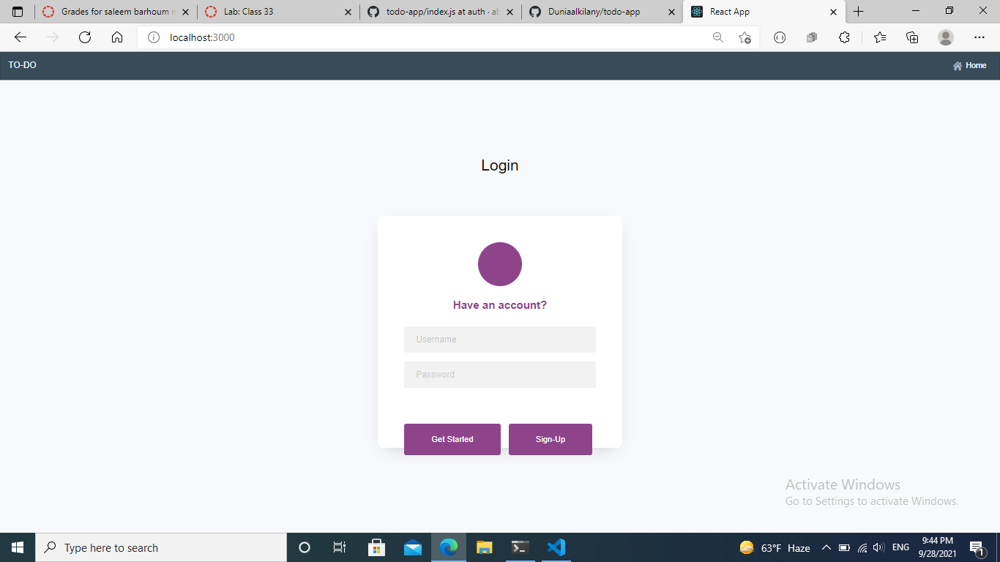
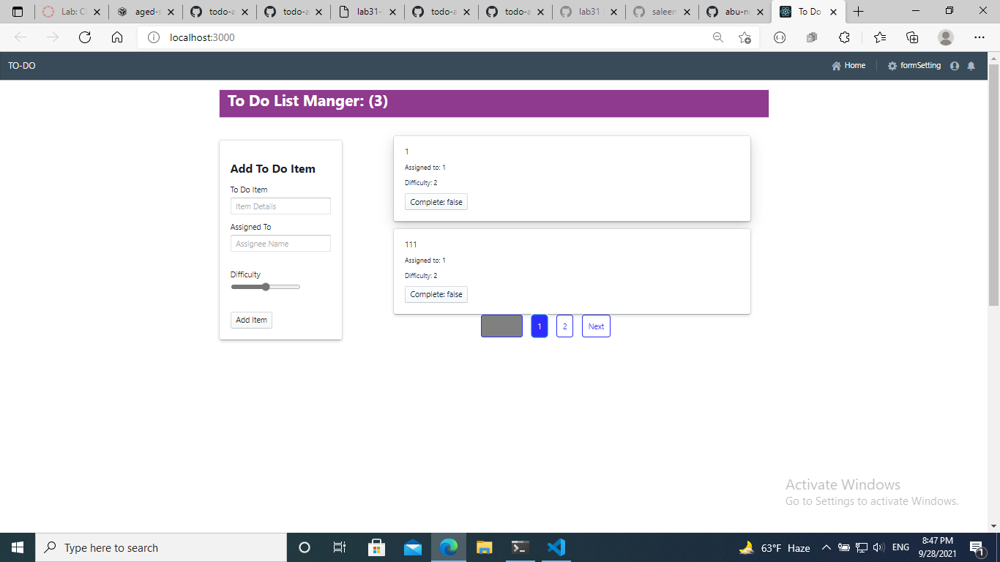

# TO-DO-app

## Author : Saleem Diab && Mohammad Atta

## LAB 34 - API Integration

## Description :

* ### one way of using global states in React by using context API. that done by creating, providing, wrapping, and consumming the context.

* ### useForm is a custom hook that contains a function that will be called when you click on the submit button, and will handle onSumbit and onchange functions.

###  TO-DO App Phase 3-4:

### Phase 3: Adding security and access controls to the application.
### Phase 4: Integrating with a live API.

### Description : this phase was refactoring and editing on TO DO App by :

1. adding sign in and sign up connected to real API.
2. add basic and bearer auth.
3. feature customization based on user role and capability.
4. connect all CRUD operations to real API.
5. activate the delete feature for the admin only.

#### getting started :

* #### sign up and choose a role
* #### log in

* #### components will be rendered based on the role as the following:

   * #### admin : read , create , update , delete .
   * #### user : read .

   ## Links and Resources:

* ### [code sand box /Phase 4](https://ni4k7.csb.app)

* ### [heroku ](https://project-34-to-do.herokuapp.com)

## UML : 

